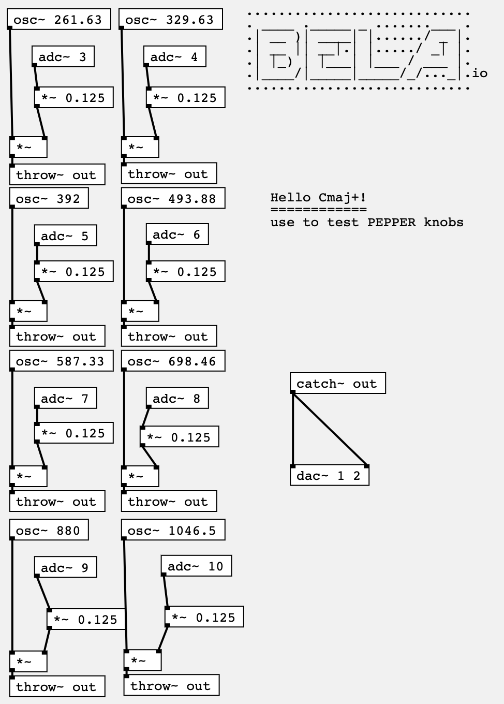

Plays an extended Cmaj7 chord on the Bela PEPPER.

You could use this to test your knobs.
Knobs 1 through 8 control the volume of each note.

Clone this repo into your projects folder:

    cd ~/Bela/projects
    git clone https://github.com/rhaleblian/pepper-cmaj7plus
  
and run it using the web IDE.

ref: https://pages.mtu.edu/~suits/notefreqs.html
